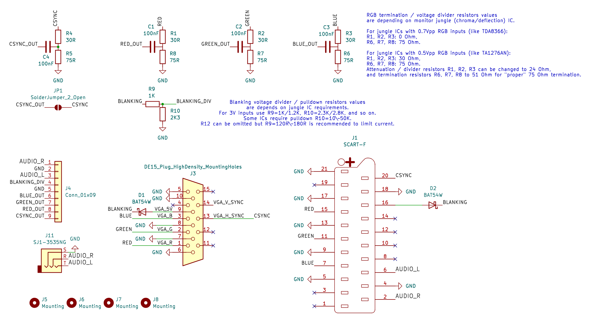
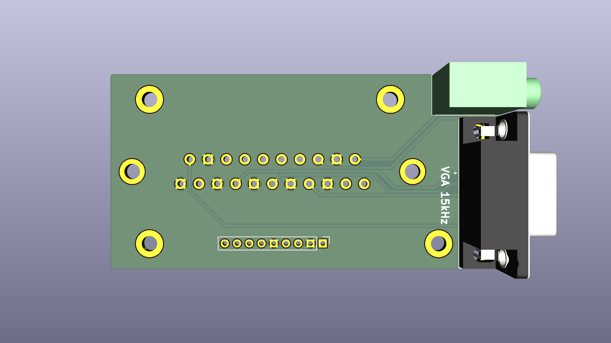
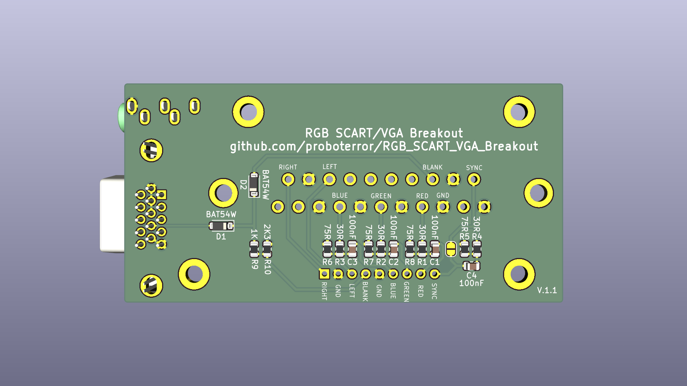
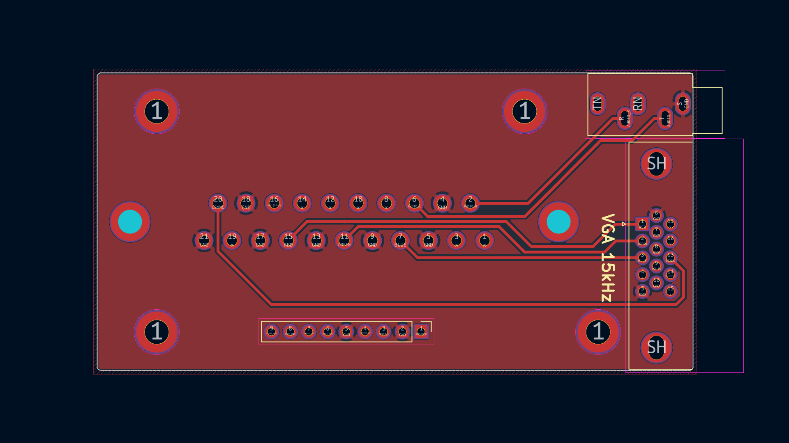
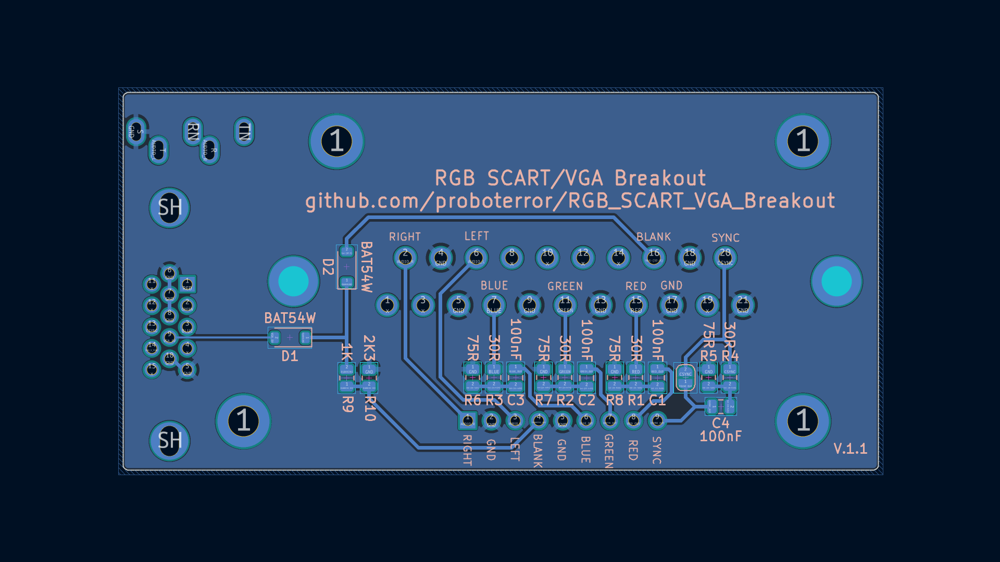
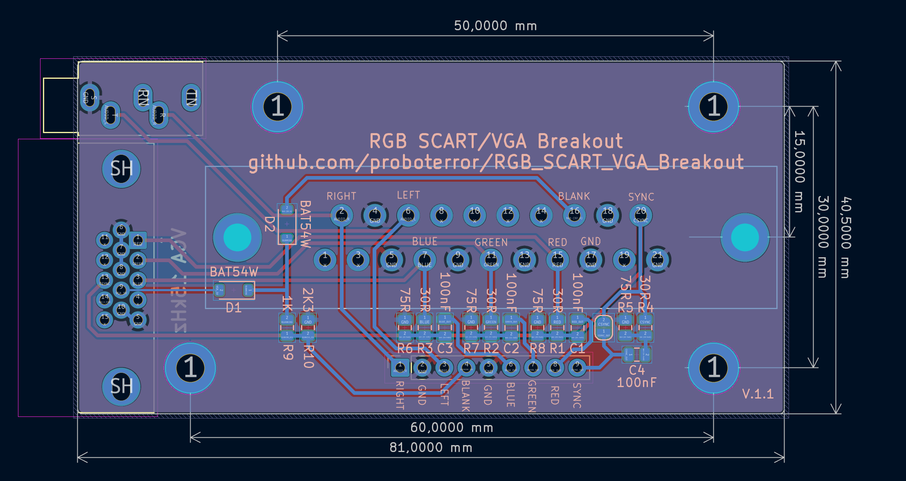

# RGB SCART / VGA Breakout

For RGB/SCART modding JVC, SONY PVM video monitors and consumer CRT TVs.

Mounting holes step 10 mm, matching JVC monitors case.

Continuation of [RGB SCART Breakout board](https://github.com/proboterror/RGB_SCART_Breakout).

Features:
- SCART / VGA inputs are not switchable. Simultaneous connection are NOT RECOMMENDED, use at own risk.
- Protection diodes on SCART Blanking / VGA +5V inputs against back current with 2 devices connected.
- Sync 75 Ohm load bypass option.
- 3.5 mm mini jack connector for SCART input.

## Schematics: 

## Board view: 

## Bill of Materials
|Reference|Value|Footprint|Qty|
|-----|-----|-----|-----|
|C1,C2,C3,C4|100nF|0805|4|
|D1,D2|BAT54W|Diode_SMD:D_SOD-123|2|
|J1|SCART-F|CS-102 (SCART-21S)|1|
|J3|DE15 Socket / DSUB-15-HD / VGA| DSUB-15-HD_Socket_Horizontal P2.29x1.90mm EdgePinOffset3.03mm MountingHolesOffset4.94mm|1|
|J11|SJ1-3535NG|CUI/Same Sky Device SJ1-3535NG|1|
|R1,R2,R3,R4|0R/24R/30R|0805|4|
|R5,R6,R7,R8|75R/51R|0805|4|
|R9|1K/1K2/4K7|0805|1|
|R10|2.3K/2K8/10K|0805|1|

Notes:
- All resistors are 1%.
- RGB termination / voltage divider resistors values are depending on monitor jungle (chroma/deflection) IC.
For jungle ICs with 0.7Vpp RGB inputs (like TDA8366):
R1, R2, R3: 0 Ohm,
R6, R7, R8: 75 Ohm.
For jungle ICs with 0.5Vpp RGB inputs (like TA1276AN):
R1, R2, R3: 30 Ohm,
R6, R7, R8: 75 Ohm.
Attenuation / divider resistors R1, R2, R3 can be changed to 24 Ohm, and termination resistors R6, R7, R8 to 51 Ohm for "proper" 75 Ohm termination.
- Blanking voltage divider / pulldown resistors values are depends on jungle IC requirements.
For 3V inputs use R9=1K/1.2K, R10=2.3K/2.8K, and so on.
Some ICs require pulldown R10=10\~50K.
R12 can be omitted but R9=120R\~180R is recommended to limit current.
- More info on Blanking voltage divider: [sector.sunthar.com/guides/crt-rgb-mod](https://sector.sunthar.com/guides/crt-rgb-mod/rgb-mux.html#how-to-use-the-voltage-divider-on-the-board)
